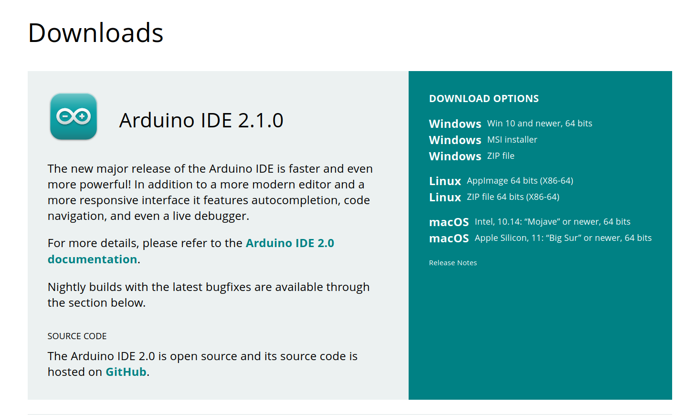
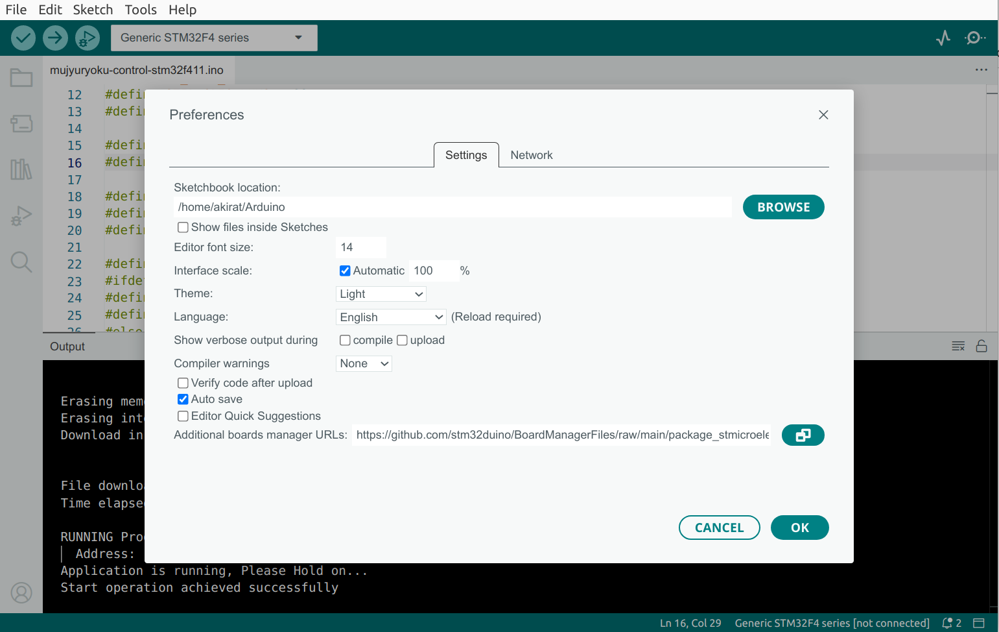
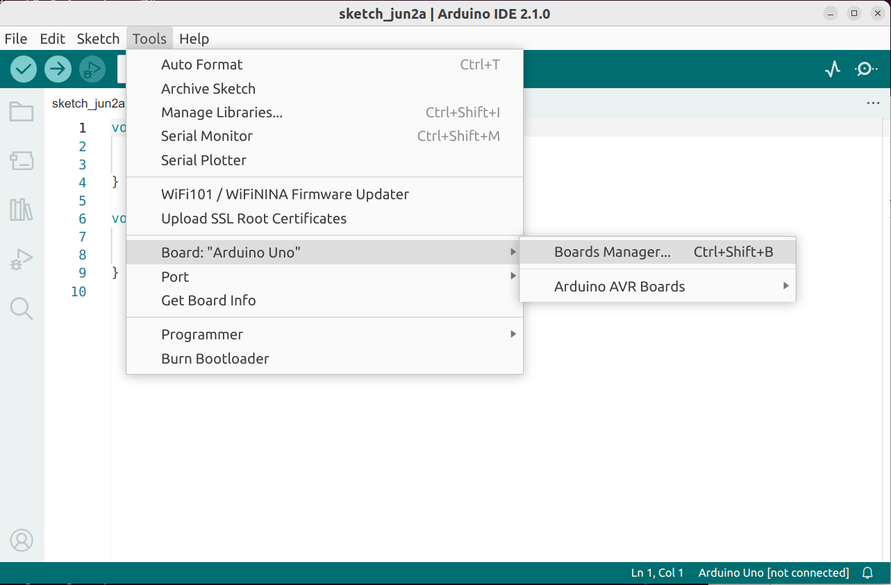
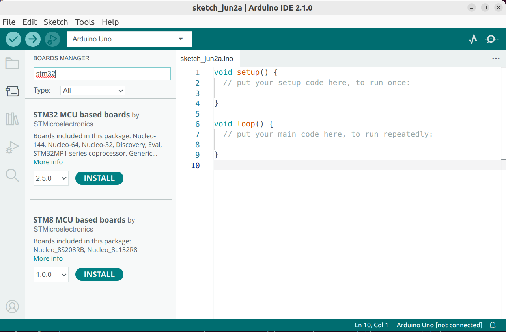
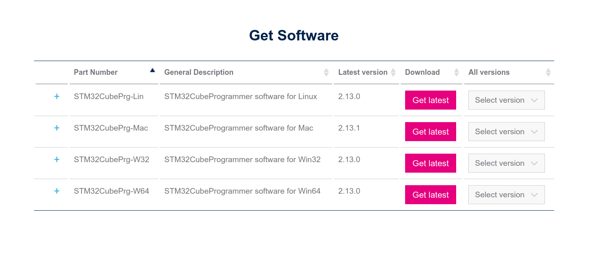

## (1) Install Arduino IDE 2

```
$ cd ~
$ mkdir bin
$ cd bin
```

Download "Linux AppImage 64 bits (X86-64)" to `~/bin`.

[Arduino site: https://www.arduino.cc/en/software](https://www.arduino.cc/en/software)




Try booting Arduino IDE 2
```
$ cd ~/bin
$ ./arduino-ide_2.1.0_Linux_64bit.AppImage
```

## Add STM32duino to Arduino

The STM32duino is an official project by ST.com for supporting Arduino on STM32.

### Add STM32 BoardManagerFiles

Go to `File > Preferences`.

Add the URL below to Additional Board Manager URLs text box:

```
https://github.com/stm32duino/BoardManagerFiles/raw/master/STM32/package_stm_index.json
```

If the text box is not empty, you can separate the URLs with a comma.



### Install STM32 support to Arduino

1. Go to `Tools > Board > Boards Manager`.


<br/>

2. Search for `STM32`, select latest version and click Install.


<br/>

## (2) Install STM32CubeProgrammer

```
$ cd ~
$ mkdir tmp
$ cd tmp
```

Download "STM32CubeProgrammer software for Linux" to `~/tmp`.

[ST.com site: https://www.st.com/en/development-tools/stm32cubeprog.html](https://www.st.com/en/development-tools/stm32cubeprog.html)



Unzip downloaded zip file.
```
$ cd ~/tmp
$ unzip ./en.stm32cubeprg-lin-v2-13-0.zip
```

Start install.
```
$ ./SetupSTM32CubeProgrammer-2.13.0.linux
```


