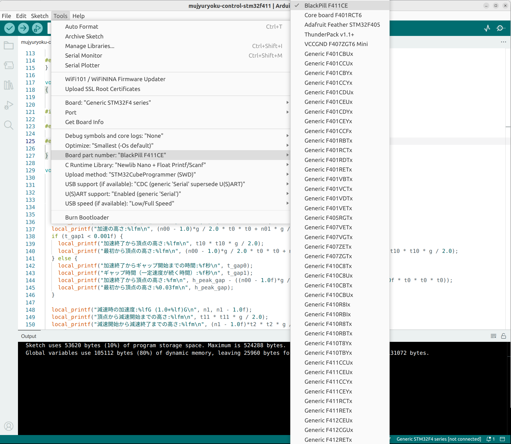

## (1) Setup Arduino IDE 2 for Black Pill STM32F411CEU6

Follow the images for applying the setting for the Black Pill STM32F411CEU6.

### Selecting Board.


### Selecting Board part number.



### Selecting Upload method.


## (2) Connecting through ST-Link V2 clone

Connect 3.3V, GND, SWCLK, SWDIO according the images.

You must connect the microB connector to the PC for supplying the power to the Nucleo.


## (3) Build the source and upload the binary to the target

Trying the LED blinking program.

The LED is connected to PC13.

```
#include <Arduino.h>

// LED_BUILTIN is assigned to an LED connected pin on most Arduino boards.
#define LED_BUILTIN PC13
int led = LED_BUILTIN;

void setup() {
  // initialize the digital pin as an output.
  pinMode(led, OUTPUT);
}

void loop() {
  digitalWrite(led, HIGH);   // turn the LED on (HIGH is the voltage level)
  delay(1000);               // wait for a second
  digitalWrite(led, LOW);    // turn the LED off by making the voltage LOW
  delay(1000);               // wait for a second
}
```


<br/>

## (4) Video of LED blinking

[](IMG_7514.mp4)
