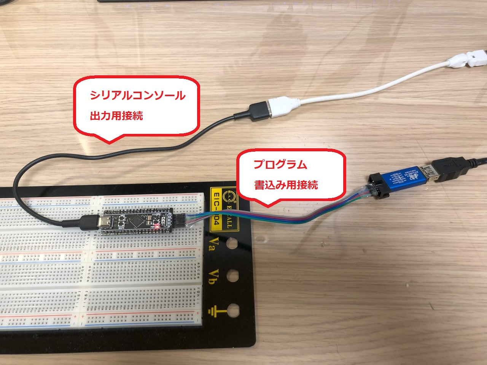
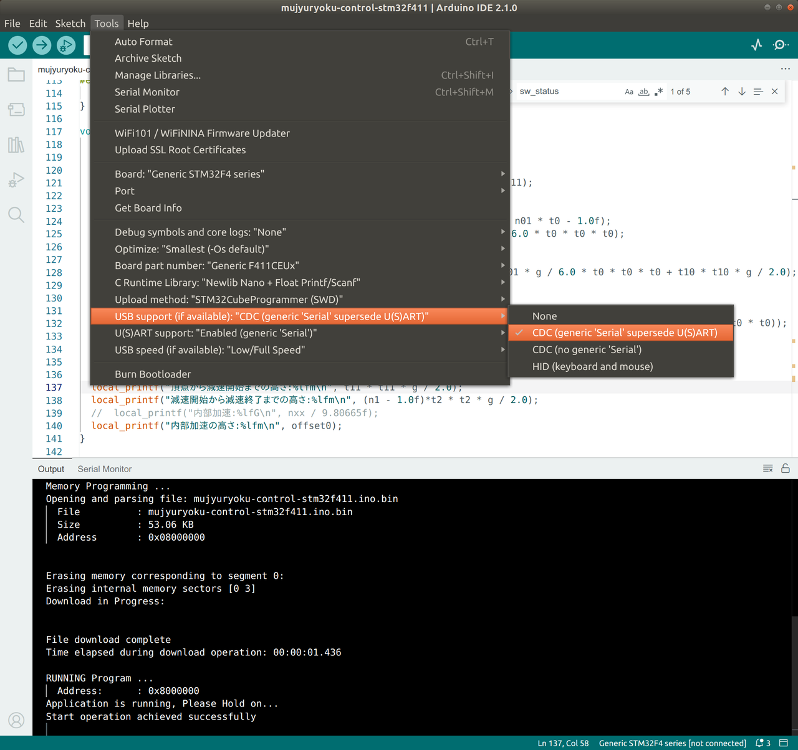
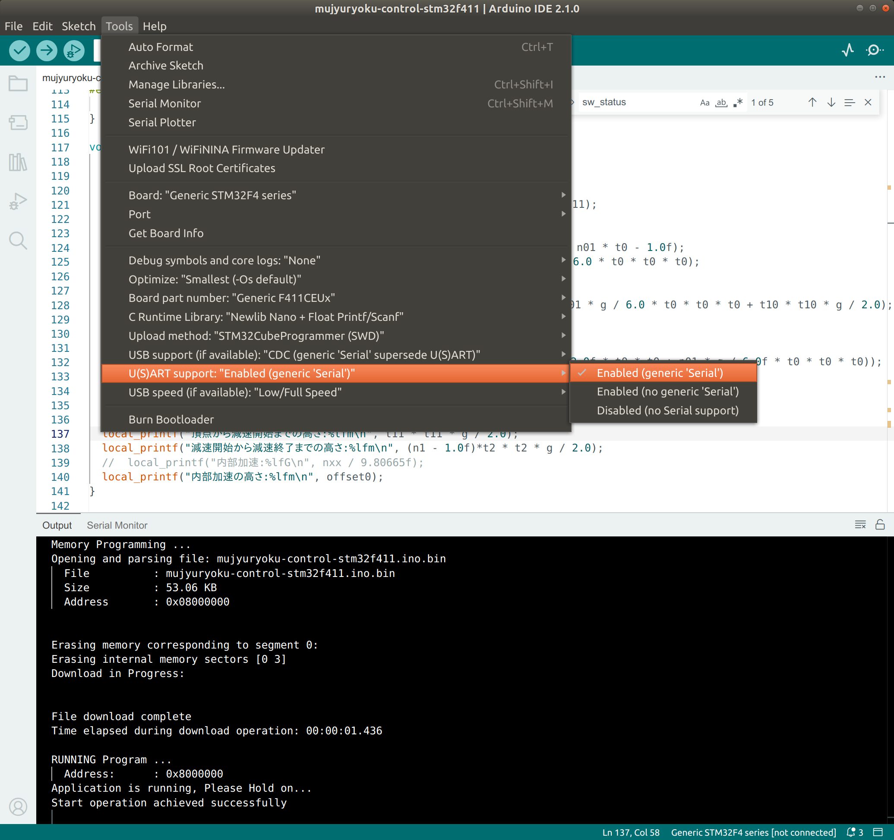
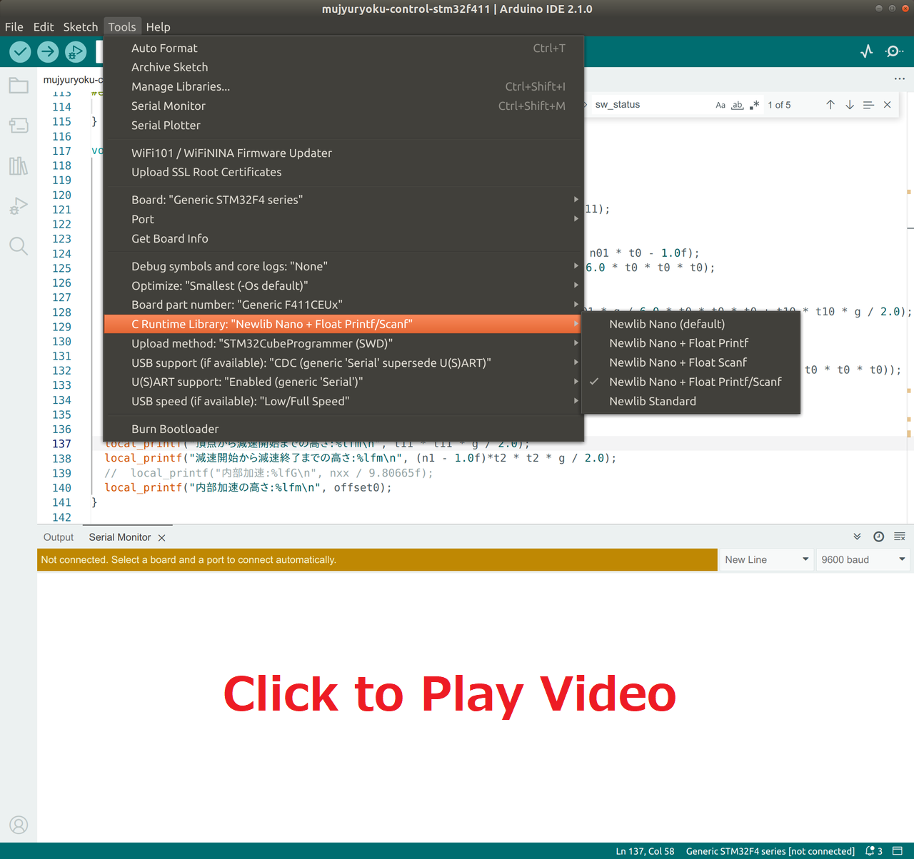
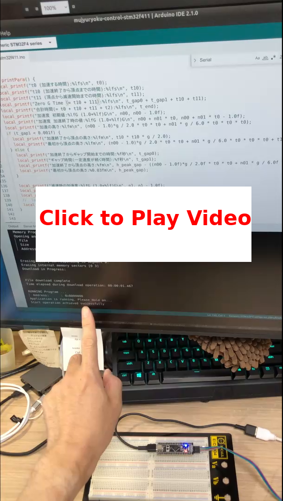

# Zero Gravity Test program on STM32F411 Black Pill

## Connecting STM32F411 for Serial output

Connect the USB-C connector to the development PC for the printf() output.


<br/>

## Setting Arduino for SerialUSB and supporting float

To enable Serial print through USB-C cable.


<br/>


<br/>

Change the Newlib to enable to user type float in the printf() function.

[](stm32-serial-setting-ss.mp4)
<br/>

## Explanation of porting the Test program to STM32F411

Mostly there was two parts required for porting ESP32 program to STM32F411.

### Change the GPIO Pins.

The SW_GPIO_NUM is `KEY` button on the Black Pill.
The PC13 is the LED on the Black Pill.
```
#define EN_GPIO_NUM         PA8
#define STEP_GPIO_NUM       PA9
#define DIR_GPIO_NUM        PA10

#define EN_GPIO_NUM2        PA5
#define STEP_GPIO_NUM2      PA6
#define DIR_GPIO_NUM2       PA7

#define SW_GPIO_NUM         PA0  // KEY button on Black Pill

#define LED_GPIO_NUM        PC13 // LED on Black Pill
#define LED2_GPIO_NUM       PC14

#define HALL_IC_GPIO_NUM    PB8
#define HALL_PW_GPIO_NUM    PB9
```

### Creating print function using SerialUSB.

The macro STM32F411xE is define by Arduino setting when selecting Black Pill STM32F411.
```
// printf function to support Serial or printf
void local_printf(char *fmt, ...)
{
  va_list argptr;
  va_start(argptr, fmt);
#ifdef STM32F411xE
  SerialUSB.printf(fmt, argptr);
#else
  printf(fmt, argptr);
#endif
  va_end(argptr);
}
```

### Made other changes to build on STM32F411.


## Build and upload Zero Gravity Test program

[](stm32-build-upload-ss.mp4)

