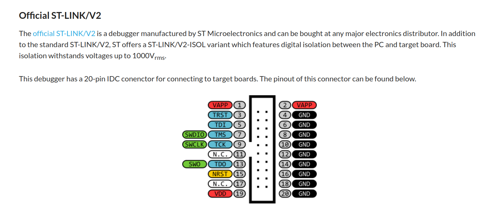
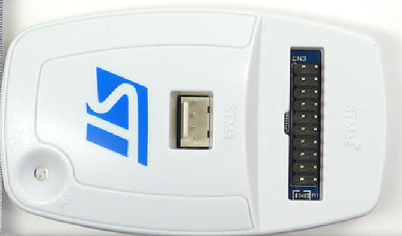
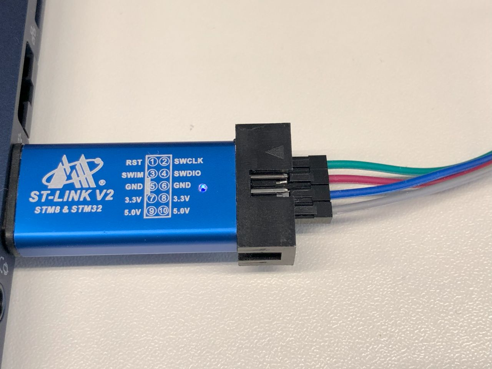

# Preparation of ST-Link V2

## ST-Link V2 Genuine




<br/>
## ST-Link V2 Clone




<br/>
## Setup 

1. Setting up udev for stlinkv2 clone to be able to have write permission under /dev.

```
$ git clone https://github.com/stlink-org/stlink
$ sudo cp stlink/config/udev/rules.d/49-stlinkv* /etc/udev/rules.d/
```

2. Connect ST-Link V2

The udev rule will grant write access to the following usb device for the ST-Link V2.
```
$ lsusb
...
Bus 003 Device 023: ID 0483:3748 STMicroelectronics ST-LINK/V2
...
```

The device of ST-Link V2 is assigned to will have write permission.
```
$ ls -l /dev/bus/usb/003/024
crw-rw-rw- 1 root root 189, 279 May 26 14:14 /dev/bus/usb/003/024
```


